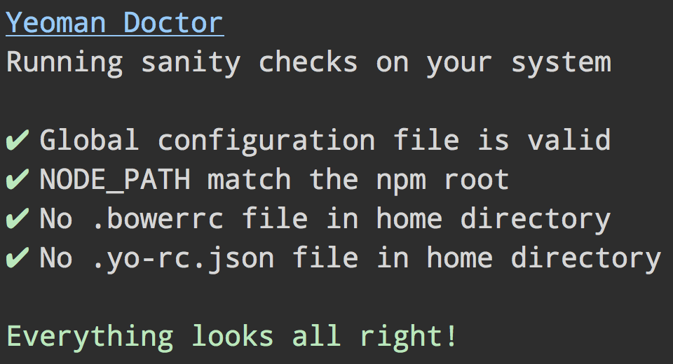

# Yeoman Doctor [](https://github.com/yeoman/doctor/actions/workflows/ci.yml)

> Detect potential issues with users system that could prevent Yeoman from working correctly




## Usage

Use as part of [`yo`](https://github.com/yeoman/yo):

```
$ yo doctor
```

Can also be run with `yo-doctor` if installed globally.


## License

BSD-2-Clause © Google
